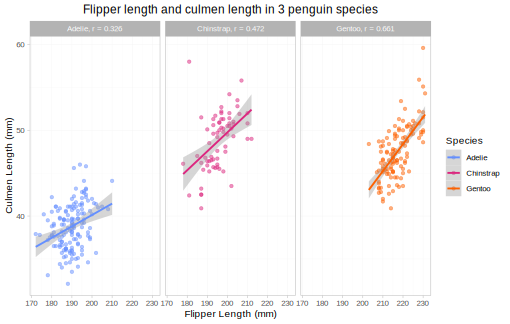

```{r setup, include=FALSE}
knitr::opts_chunk$set(echo = TRUE)
```

### Introduction

In this report, I will perform a simple data analysis using the Palmer Penguins dataset, exploring the relationship between flipper and beak length (using culmen length as a measurement) in 3 different species of penguin: Adelie, Chinstrap, and Gentoo. By doing this, I will evaluate the relationship between flipper and beak length in each species individually, and determine whether there is a significant difference between the species. 

For this analysis, I use the following packages:

- ggplot2
- palmerpenguins
- janitor
- dplyr
- ragg
- svglite
- cocor
```{r, include=FALSE}
#install.packages(c("ggplot2", "palmerpenguins", "janitor", "dplyr", "svglite", "cocor", "ragg"))
library(ggplot2)
library(palmerpenguins)
library(janitor)
library(dplyr)
library(ragg)
library(svglite)
library(cocor)
```

The dataset comes from the palmerpenguins package, and must be cleaned before it is useful.
```{r}
#reading in cleaning functions
source("functions/cleaningFunctions.r")

# old code to save the raw data as a csv file
# write.csv(penguins_raw, "data/penguins_raw.csv")

#reading in the raw data from a csv
penguins_raw <- read.csv("data/penguins_raw.csv")

#cleaning the old data, and saving it as a new csv
penguins_clean <- full_clean(penguins_raw)
# write.csv(penguins_clean, "data/penguins_clean.csv")
```


### Hypothesis

I predict that a) there will be a positive correlation between flipper length and culmen length in each species, and b) this relationship will not significantly differ between species.


Hypothesis A:

- H1: there is a positive correlation between flipper length and culmen length in all 3 species: r > 0
- H0: there is not a positive correlation between flipper length and culmen length in all 3 species: r <= 0

Hypothesis B:

- H1: there is a significant difference between the three correlation coefficients: r1 != r2 and/or r1 != r3 and/or r2 != r3
- H0: there is no significant difference between the three correlation coefficients: r1 = r2 = r3


### Statistical Methods

For this analysis, I use the following packages:

- ggplot2
- palmerpenguins
- janitor
- dplyr
- ragg
- svglite
- cocor
```{r, include=FALSE}
#install.packages(c("ggplot2", "palmerpenguins", "janitor", "dplyr", "svglite", "cocor", "ragg"))
library(ggplot2)
library(palmerpenguins)
library(janitor)
library(dplyr)
library(ragg)
library(svglite)
library(cocor)
```

The dataset comes from the palmerpenguins package, and must be cleaned before it is useful. The cleaned dataset is saved as a csv file to be read in during the analysis.
```{r}
#reading in cleaning functions
source("functions/cleaningFunctions.r")

# old code to save the raw data as a csv file
# write.csv(penguins_raw, "data/penguins_raw.csv")

#reading in the raw data from a csv
penguins_raw <- read.csv("data/penguins_raw.csv")

#cleaning the old data, and saving it as a new csv
penguins_clean <- full_clean(penguins_raw)
# write.csv(penguins_clean, "data/penguins_clean.csv")
```

To begin analysing my data, I will first create an exploratory graph looking at the relationship between flipper length and culmen length. This exploratory graph is saved as a vector in the file basic_report_18mmx4.5in.svg. The code to save this graph is included, but in comments in this file. 
```{r}
#reading in saved clean data from the file
penguins_clean <- read.csv("data/penguins_clean.csv")

#reading in plotting functions
source("functions/plottingFunctions.r")

#savs the exploratory graph as a vector with the specified dimensions
#save_basic_graph_pvg(penguins_clean, "figures/basic_report_18mmx4.5in.svg", 7.08661, 4.5, 1)
```


The overall relationship between flipper and culmen length across all three species can be tested using a two-sided Pearson's correlation coefficient.
```{r}
cor.test(penguins_clean$flipper_length_mm, penguins_clean$culmen_length_mm, method = "pearson")
```
This shows that there is a correlation of 0.656 across all the species, and that this correlation is highly significant: P < 0.01. 0.656 is a fairly strong correlation between flipper and culmen length, suggesting the two variables are related across all three penguin species.

However, this does not show the correlation within species, which is what I am interested in. To find this, I have to subset my data by species, and do individual two-sided Pearson's correlation tests. 
``` {r}
# filtering the cleaned dataset to produce new variables containing just one species each
adelie <- filter_by_species(penguins_clean, "Adelie")
chinstrap <- filter_by_species(penguins_clean, "Chinstrap")
gentoo <- filter_by_species(penguins_clean, "Gentoo")

cor.test(adelie$flipper_length_mm, adelie$culmen_length_mm, method = "pearson")
cor.test(chinstrap$flipper_length_mm, chinstrap$culmen_length_mm, method = "pearson")
cor.test(gentoo$flipper_length_mm, gentoo$culmen_length_mm, method = "pearson")
```

The results of these tests are summarised here:

|Species|n|r|p|Significance| 
|-------|-|-|-|------------|
|Adelie|151|0.326|4.465e-05|***|
|Chinstrap|68|0.472|4.916e-05|***|
|Gentoo|123|0.661|2.2e-16|***|
  

This shows that all three correlation coefficients are positive, and significant at the P < 0.01 level, meaning I can reject null hypothesis A: there is evidence to suggest that all three correlation coefficients are positive, meaning there is a positive correlation between flipper and culmen length.

This does not answer whether the relationship is significantly different between these groups: to do this, I need to perform significance tests on each pair of correlation coefficients. As the species are independent groups, significance can be tested between pairs of species by first using a Fisher's r to Z transformation on the correlation coefficients, for use in a Fisher's Z test, which is checked against Zou's confidence interval. This can be done using the cocor package. 

```{r}
## Adelie--Chinstrap comparison
cocor.indep.groups(0.326, 0.472, 151, 68)

## Adelie--Gentoo comparison
cocor.indep.groups(0.326, 0.661, 151, 123)

## Chinstrap--Gentoo comparison
cocor.indep.groups(0.472, 0.661, 68, 123)
```

The results are summarised here:


|Comparison|z|p|Confidence Interval|Significance|
|----------|-|-|-------------------|------------|
|Adelie-Chinstrap|-1.1713|0.2415|-0.3707, 0.1030| |      
|Adelie-Gentoo|-3.7141|0.0002|-0.5101, -0.1585|***|
|Chinstrap-Gentoo|-1.8307|0.0671|-0.4161, 0.0122| |

  
This analysis shows that the correlation found in Adelie penguins was not significantly different from Chinstraps, and Chinstrap penguins did not have a significantly different correlation than Gentoos. However, Chinstrap and Gentoo penguins had a significantly different correlation, at a p value of 0.0002. Only this pair had a confidence interval which did not cross 0, indicating that there is a significant difference between the two correlations. 

This means that there is sufficient evidence to reject null hypothesis B: while there are no significant differences between 2 pairs of the 3 species, one pair (Adelie-Gentoo) have a significant difference in their correlations between flipper and culmen length, as their Z value falls outside of the confidence interval. 

### Results

The results of the first part of my analysis are illustrated in the following graph, showing the correlation between flipper and culmen length in the three individual species. This graph is saved as a vector, as results_report_18mmx4.5in.svg, with the code to save this graph commented. 

```{r}
#save_results_graph_pvg(penguins_clean, "figures/results_report_18mmx4.5in.svg", 7.08661, 4.5, 0.9)
```


Additionally, the results of the stats tests performed are shown in the following table:

|Species|n|r|p|Significance|Different from:|Adelie|Chinstrap|Gentoo|
|:-------|:-|:-|:-|:------------:|-|:------:|:---------:|:------:|
|Adelie|151|0.326|4.465e-05|***| | | |***|
|Chinstrap|68|0.472|4.916e-05|***| | | | | 
|Gentoo|123|0.661|2.2e-16|***| |***| | |

### Discussion

These results suggest there is some relationship between flipper length and culmen length. My first hypothesis was that there is a positive relationship between these two variables, which I have found evidence to support: there is a significant positive correlation coefficient for all three species. My second hypothesis was that there is not a significant difference in this relationship between species. I found evidence to reject this as a null hypothesis, as there was a significant difference between the correlation coefficients of these factors found in Adelie and Gentoo penguins: Gentoo penguins have a stronger positive correlation between flipper and beak length than Adelie penguins. As the test comparing Chinstrap and Gentoo penguins had a p-value of 0.0661, it fell just outside of the confidence interval. It is possible that with a larger sample size, these two species could be found to have a significantly different relationship, resolving the seemingly illogical conclusion that Gentoos and Adelies differ but Chinstraps do not differ from either. However, this analysis has shown that different penguin species may have different relationships between their beak and flipper lengths. 

These results suggest that beak and flipper length may be related by a third factor, such as body mass Further tests would need to be performed to confirm this, by analysing the relationship between each of the three factors individually in each species. Furthermore, they show that the relationship between beak and flipper size differs by species in some cases, which may be reflective of differences in the variability of morphological features between species. This analysis could be used as a starting point to evaluate the relationship between body features between penguin species in more detail. 

### Conclusion

This analysis evaluated the relationship between flipper and beak length in Adelie, Chinstrap, and Gentoo penguins. I found that these factors are significantly positively correlated both across and within species, but the strength of this correlation differs with species. Gentoo penguins had a stronger correlation between flipper and beak length than Adelie penguins, while Chinstrap penguins were not found to have a significantly different correlation to either. Further analysis could shed light on the difference in this relationship between Chinstrap and Gentoo penguins, and determine the causative factors behind this relationship in all three species. 
